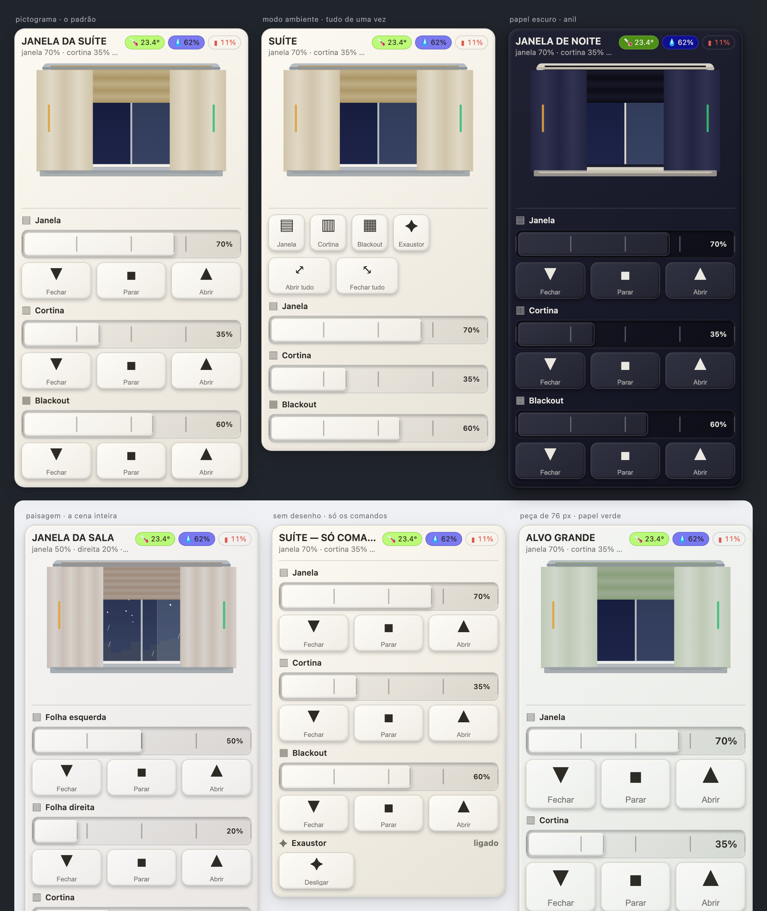

<!-- MW-BRAND:BEGIN — gerado por IA/tools/mw-brand.sh · não editar à mão -->
<p align="center">
  <a href="https://github.com/visaodeempresa">
    
  </a>
  <br>
  <sub><b>Visão de Empresa</b> · componente de Home Assistant por MAYCON WILLIAN OLIVEIRA</sub>
</p>
<!-- MW-BRAND:END -->

# MW Window / Curtain **Paper** Card

[](https://github.com/visaodeempresa/mw-ha-window-curtain-paper-card/actions/workflows/ci.yml)
[](https://github.com/visaodeempresa/mw-ha-window-curtain-paper-card/releases)
[](https://hacs.xyz)

A janela do Home Assistant desenhada em **papel** e feita para o **dedo**.

O card irmão ([MW Window / Curtain Card](https://github.com/visaodeempresa/mw-ha-window-curtain-card))
desenha a janela lindamente — e pede que você acerte um botão de 26 × 24 px.
Este troca isso por **peças de papel de 56 px**, uma **régua de degraus** que se
arrasta com o polegar (e se dirige pelo teclado, coisa que nenhum card MW tinha),
e um **pictograma** que custa menos de um terço dos nós do desenho completo —
com a paisagem inteira a um clique de distância, quando você quiser.



Primeira fila, sobre fundo escuro: o **pictograma**, que é o padrão; o **modo
ambiente**, com janela, cortina, blackout e exaustor em peças grandes mais
«abrir tudo» e «fechar tudo»; e o mesmo card em **papel escuro anil**.
Segunda fila, sobre fundo claro: a **cena com paisagem** (sala de 4 folhas, céu
de noite, chuva no vidro); o modo **sem desenho**, só os comandos; e a peça de
**76 px** em papel verde.

## O que ele faz que o irmão não faz

| | Paper Card | Window / Curtain Card |
|---|---|---|
| alvo de toque | **56 px** (44–96, com piso travado) | 26 × 24 px |
| ajuste de posição | **régua de papel** com degraus, arrasto e **teclado** | `input[type=range]`, polegar de 15 px |
| desenho | **3 modos**: pictograma · paisagem · nenhum | um só, sempre com paisagem |
| um card por ambiente | **modo ambiente**: tudo lado a lado | uma linha por alvo |
| retorno ao toque | **vibração** e troca de relevo | `translateY(1px)` |
| foco por teclado | `:focus-visible` em toda peça | — |

O irmão continua sendo a escolha certa quando o que importa é **a janela como
quadro**: acessórios posicionados na cena, tubo de ar, ventoinha solar,
tomadas na parede, seis tecidos com trama por filtro SVG. Este aqui é a escolha
certa quando o que importa é **comandar**.

## Instalação

HACS → Dashboard → repositório customizado
`visaodeempresa/mw-ha-window-curtain-paper-card` → instalar → recarregar o
navegador com cache limpo.

## Uso

```yaml
type: custom:mw-window-curtain-paper-card
name: Janela da suíte
opener: cover.0xbc026efffe0b49f4
curtain: cover.cortina_da_suite
temperature: sensor.temperatura_da_janela_da_suite
humidity: sensor.umidade_da_janela_da_suite
```

No editor visual, escolha o **ambiente** e aperte **«Montar a janela sozinho»**:
o card acha empurrador, cortina, blackout, exaustor, sensores de abertura e o
trio temperatura/umidade/bateria pela área do HA.

### O modo ambiente

```yaml
type: custom:mw-window-curtain-paper-card
name: SUÍTE
room_mode: true
area: suite
opener: cover.0xbc026efffe0b49f4
curtain: cover.cortina_da_suite
exhaust: fan.exaustor_da_suite
```

Uma fileira de peças grandes com tudo do ambiente, mais **abrir tudo** e
**fechar tudo** — que é o que a sala (dois empurradores) e a suíte pedem na
prática.

### As opções que mudam o peso da tela

| chave | valores | padrão |
|---|---|---|
| `scene_mode` | `pictograma` · `paisagem` · `none` | `pictograma` |
| `control_size` | 44–96 (px) | `56` |
| `slider_style` | `regua` · `barra` · `none` | `regua` |
| `regua_steps` | `"0,25,50,75,100"` | idem |
| `controls` | `auto` · `compact` · `none` | `auto` |
| `room_mode` | booleano | `false` |
| `paper` / `paper_dark` | `<matiz>-<1..7>` · rampa escura | `paper` / `false` |
| `haptic` | booleano | `true` |

A lista inteira está no editor visual, com rótulo em português — e toda chave
tem um campo lá (o `tools/probe.js` reprova o contrário).

## Acessibilidade

- Todo alvo tem **no mínimo 44 px** nos dois eixos. `control_size: 10` é
  **elevado** para 44, não obedecido.
- A régua é `role="slider"` com `aria-valuenow`/`aria-valuetext`, e responde a
  `←/→` (±5), `↑/↓` (±10), `PageUp/PageDown` (±25), `Home` e `End`.
- Toda peça é um `<button>` com `aria-label`, foco visível e rótulo que muda
  com o estado (o botão do exaustor diz «Desligar» quando ele está ligado).

## Performance

- **Monta uma vez, pinta por variável CSS.** O HA entrega um objeto `hass` novo
  a cada evento de qualquer entidade da casa; o card compara uma assinatura e
  não toca no DOM quando nada que ele mostra mudou.
- **Nenhum `@keyframes` toca `box-shadow`, `filter`, `width`, `height`, `left`,
  `top`, `margin` ou `padding`** — o probe reprova o contrário. Relevo de papel
  é sombra parada, que o navegador guarda em cache.
- **Sem `backdrop-filter`** em lugar nenhum.
- `contain: layout paint style` na cena e na barra de controles;
  `container-type: inline-size` para o card se adaptar à **coluna**, não à
  janela do navegador — sem uma única `@media`.
- Fora da tela, o card não pinta (`IntersectionObserver`).

## Desenvolvimento

```bash
node --check dist/mw-window-curtain-paper-card.js
node tools/probe.js                      # 57 provas, termina em "tudo certo."
IA/tools/check-embeds.sh                 # os 5 blocos batem com IA/lib/
```

Bancada: `preview_start` com `mw-window-curtain-paper-preview` (porta 8793) e
abrir `/tools/preview.html`. **Não abre por `file://`** — o `<script src>`
morre em silêncio.

## Licença

MIT © MAYCON WILLIAN OLIVEIRA
